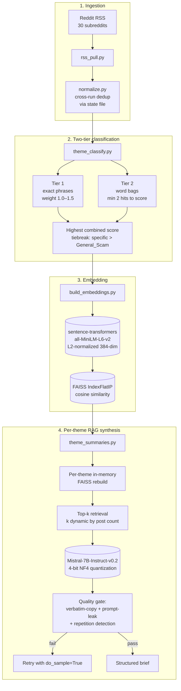

# reddit-fraud-intelligence

End-to-end Retrieval-Augmented Generation pipeline that ingests Reddit posts from fraud-relevant subreddits via RSS, classifies each post against an 18-theme fraud taxonomy with transparent two-tier keyword matching, builds FAISS-indexed semantic embeddings, and uses a locally-hosted **Mistral-7B-Instruct-v0.2 (4-bit NF4 quantized)** to generate one structured analytical brief per fraud theme per run.

**Output template per theme:** `Pattern` — what tactic is repeated · `Targets & Impact` — who is affected and how · `Watch signals` — comma-separated keywords to monitor.

> Built as the individual technical contribution within a graduate capstone with a financial-services sponsor. This is a sanitized public version: sponsor-specific references in source-list keywords, demographic-targeting query strings, and dashboard branding have been removed or genericized. See [Sanitization notes](#sanitization-notes) below.

---

## Why this exists

Fraud intelligence on emerging tactics is fragmented across government agencies, cybersecurity publishers, and online communities. Reddit posts in particular often surface new scam variants and victim experiences **days to weeks ahead of formal channels** — but the signal is buried in unstructured posts written in varying styles, frequently misclassified, and difficult to monitor at scale.

This pipeline converts that unstructured community signal into a structured, refreshable daily brief that a fraud analyst can read in five minutes.

---

## Architecture



**Data layout** (run-date partitioned, Snowflake-readiness via Parquet):

```
data/
├── raw/reddit/run_date=YYYY-MM-DD/         # Raw RSS pulls (CSV + Parquet)
├── curated/reddit/run_date=YYYY-MM-DD/     # Normalized + cross-run deduped
├── scored/reddit/run_date=YYYY-MM-DD/      # Themed + FAISS index + embeddings
└── summaries/reddit/run_date=YYYY-MM-DD/   # Structured theme briefs
state/reddit_state.json                      # Cross-run dedup: all seen post URLs
```

---

## Quickstart

### Prerequisites
- **Google Colab with A100 GPU runtime** for Mistral-7B + sentence-transformers in memory together. Smaller GPUs require model substitution (see [Adapting to other compute](#adapting-to-other-compute)).
- Google Drive mounted (for data partition storage)
- Python 3.12

### Install
```bash
git clone https://github.com/michael-johnson03/reddit-fraud-intelligence.git
cd reddit-fraud-intelligence
pip install -r project/requirements.txt
```

### Configure
Edit `project/config.yaml` to set:
- `data_root`: where partitioned outputs are written
- `state_path`: cross-run dedup state file location
- `subreddits`: the list of subreddits to monitor (30 entries by default)
- `rss.per_subreddit_limit`: posts per subreddit per run (default 25)

### Run a single date
```bash
cd project
python -m fraud_reddit_sentiment.cli --date 2026-04-08
```

Flags:
| Flag | Default | Effect |
|---|---|---|
| `--date YYYY-MM-DD` | today UTC | Run-date partition tag |
| `--skip-embeddings` | false | Skip embedding generation (theme classification only) |
| `--skip-theme-summaries` | false | Skip LLM synthesis (classify + embed only) |
| `--top-k N` | 8 | Top-k chunks retrieved per theme for synthesis |
| `--min-posts-per-theme N` | 3 | Minimum posts before a theme gets a synthesized brief |

---

## Production runs (real evidence)

Six production runs across the capstone:

| Run date | New posts (post-dedup) | Cumulative seen | Synthesis model |
|---|---|---|---|
| 2026-03-22 | 6 | 6 | `google/flan-t5-large` |
| 2026-03-29 | 100 | 106 | `google/flan-t5-large` |
| 2026-04-06 | 200 | 306 | `google/flan-t5-large` |
| 2026-04-07 | 0 | 306 | `facebook/bart-large-cnn` |
| 2026-04-08 | 264 | 570 | `mistralai/Mistral-7B-Instruct-v0.2` |
| 2026-04-27 | (final) | 870 (all-time unique posts seen) | `mistralai/Mistral-7B-Instruct-v0.2` |

**Model progression is part of the work.** The pipeline started with `flan-t5-large` (cheap, fast, sequence-to-sequence) for the first three runs. The April 7 BART-CNN experiment was extractive-summarization-tuned and tended to copy posts verbatim into the Pattern field — the quality gate caught some but not all, and the outputs read as low-quality. Mistral-7B with 4-bit NF4 quantization replaced both for the final two production runs, and the synthesis quality improved meaningfully (see `docs/sample_output.md` for side-by-side examples). The lesson: bigger model isn't always the answer, but for grounded analytical synthesis specifically, 7B+quantization beat both smaller seq2seq and larger extractive options at this corpus size.

**April 8 theme distribution** (264 new posts):

| Theme | Posts |
|---|---|
| Other_Unclear | 110 (41.7%) |
| Payment_Scams_P2P | 48 |
| Phishing_Smishing | 39 |
| Identity_Theft | 25 |
| Investment_Scam | 9 |
| Tech_Support_Scam | 8 |
| ATO_Account_Takeover | 8 |
| General_Scam | 7 |
| Crypto_Fraud | 7 |
| BEC_Business_Email_Compromise | 2 |
| Consumer_Billing_Fraud | 1 |

Other_Unclear at ~40% is a known coverage gap, honestly reported. See [Honest limitations](#honest-limitations) below.

---

## Engineering decisions

These are the non-obvious choices and the reasoning behind them. Each subsection answers an interview question.

### Why two-tier classification (phrases + word bags) instead of an ML classifier
- **Tier 1**: ~600 exact phrases curated by fraud-domain reading, each weighted 1.0–1.5 by specificity. *"Account takeover"* (weight 1.5) is high-confidence; *"two factor"* (weight 1.0) is broader. Word-boundary regex prevents substring false positives (*"car"* in *"card"*).
- **Tier 2**: per-theme word bags scored only when ≥2 distinct words match in a single post (single-word matches don't score — noise reduction).
- Both tiers contribute additively to a combined score; the highest-scoring theme wins, with specific themes preferred over `General_Scam` on ties.
- **Why not an ML classifier**: explainability. Every classification carries a `theme_score` and a `theme_matches` field listing the actual phrases that triggered the assignment. A compliance reviewer can immediately see *why* a post was tagged. Black-box ML doesn't give you that. For a regulated-industry use case, this matters more than the recall gain a transformer classifier would provide.

### Why FAISS `IndexFlatIP` with L2-normalized embeddings
- FlatIP on L2-normalized vectors is mathematically equivalent to cosine similarity but ~3× faster than `IndexFlatL2` for our scale (~600 posts per run).
- No index training, no quantization tradeoffs — at this scale, exact search is the right answer. Approximate indices (IVF, HNSW) only earn their complexity above ~50k vectors.
- File-backed: a single `.faiss` artifact per run, reproducible, debuggable.

### Why MiniLM-L6-v2 (384-dim) over a larger embedding model
- At ~600 posts per run, retrieval quality from MiniLM is more than sufficient — the limiting factor is corpus size, not embedding dimension.
- A 768-dim model would double storage and embedding time with no measurable recall benefit at this scale.
- Larger embedding models earn their cost above ~10k documents or when the retrieval quality at top-1 specifically matters (it doesn't here; we retrieve top-k with k=8–20).

### Why 4-bit NF4 quantization on Mistral-7B
- A100 has 40 GB or 80 GB VRAM. Without quantization, Mistral-7B in fp16 consumes ~14 GB just for weights; with sentence-transformers, FAISS, and Python overhead in the same Colab session, that's tight.
- 4-bit NF4 (Normal Float 4) with double-quantization brings Mistral-7B to ~4 GB while preserving most of the synthesis quality (per the QLoRA paper, [Dettmers et al. 2023](https://arxiv.org/abs/2305.14314)).
- Compute dtype is fp16 — quantization happens on weights, not on activations.

### Why per-theme in-memory FAISS retrieval (not one global index)
A global vector index across all themes would return cross-contaminated evidence — a synthesis query for *"phishing tactics"* might retrieve identity-theft posts because they're semantically adjacent. Per-theme retrieval guarantees that synthesis evidence stays within the theme.

Cost: each theme's posts get re-embedded and indexed fresh per run. At ~600 posts split across 18 themes, this is small and fast (<1 minute total).

### Why structured output (Pattern / Targets & Impact / Watch signals)
A fraud analyst doesn't need a prose summary; they need three structured pieces:
1. *What tactic is being used?* (Pattern)
2. *Who's being affected?* (Targets & Impact)
3. *What signals do I add to my watchlist?* (Watch signals)

Free-form summaries are harder to diff across days or compare across themes. The structured template makes change-over-time meaningful and makes the brief skimmable in seconds.

### Why a multi-layer quality gate
Early iterations showed three failure modes:
1. **Verbatim copying**: the LLM extracts post text into the Pattern field instead of synthesizing
2. **Prompt leakage**: tokens like `[INST]`, `Evidence:`, or `submitted by` leak into the output
3. **Repetition latching**: the same sentence appears 3+ times when the model gets stuck

The `_is_low_quality()` check tests all three. If it fires, the synthesizer retries with `do_sample=True` to break the pattern lock-in.

### Why dynamic top-k based on post count
With <20 posts per theme, top-k=8 is sufficient and the entire small corpus is meaningful. At 50+ posts per theme, top-k=20 gives the LLM enough breadth to see repeated patterns. The pipeline picks dynamically (`dynamic_k = 20` if ≥50 posts; `15` if ≥20; else `min(top_k, post_count)`).

### Why a deliberate scope pivot mid-project
The initial scope was "Reddit sentiment scoring" — VADER scores aggregated daily/weekly. After stakeholder feedback that sentiment scores weren't actionable (analysts don't act on *"sentiment was negative this week"*), scope shifted to thematic RAG synthesis with structured output. Legacy sentiment infrastructure (VADER scorer, daily/weekly aggregates) was deprecated rather than maintained, which simplified the codebase.

---

## Sanitization notes

This public version differs from the original sponsor build:
- **`config.yaml`** — the sponsor-specific subreddit and related-comment removed from the subreddit list (line ~21)
- **`fraud_taxonomy.py`** — sponsor-name keyword and word-bag entries genericized to general-financial-institution terminology
- **`theme_summaries.py`** and **`retrieve_theme_evidence.py`** — `Military_Scam` query strings genericized: sponsor-specific demographic targeting removed
- **`app.py`** / **`app_final.py`** / **`tab3_cross_analysis.py`** — dashboard branding and analyst-assistant system prompts genericized; sponsor-specific question presets removed

The classification logic, scoring weights, FAISS retrieval, Mistral synthesis, and quality gates are unchanged.

---

## Honest limitations

- **Manual orchestration.** Runs on-demand in Google Colab; no scheduled refresh. Productionization would require a Cloud Function or Lambda with a cron trigger.
- **GPU dependency.** A100 GPU is required for the synthesis step. Smaller GPUs require model substitution (Phi-3-mini, Llama-3-8B-Instruct, or remaining on Flan-T5-Large with quality loss).
- **Other_Unclear is ~40% of posts.** The 18-theme taxonomy doesn't capture every Reddit-fraud topic. Expanding the taxonomy is iterative work — the obvious next step is to cluster the Other_Unclear bucket and surface emergent themes.
- **RSS depth is capped at 25 posts/subreddit/run.** Low-volume themes (Sanctions, Terrorist_Financing, Human_Trafficking, BEC) won't produce reliable summaries until daily runs accumulate weeks of data.
- **Keyword classification trades recall for explainability.** A transformer classifier (e.g., a fine-tuned DistilBERT) would catch more posts, especially the Other_Unclear bucket, but would lose the auditable trace. The tradeoff was deliberate.
- **No incremental embedding updates.** Each run re-embeds the full corpus from scratch. Fine at ~600 posts; needs incremental updates past ~10k.
- **No production observability.** No metrics, no traces, no error monitoring. Acceptable for graduate capstone; mandatory before any production deployment.
- **`retrieve_theme_evidence.py` is unused by the CLI.** It was an earlier evidence-retrieval module that got superseded by inline per-theme retrieval in `theme_summaries.py`. Kept in the repo for reference/comparison but not on the active code path.

---

## Adapting to other compute

If you don't have A100 access:

| Compute | Recommended model | Notes |
|---|---|---|
| A100 (40 or 80 GB) | `mistralai/Mistral-7B-Instruct-v0.2` (4-bit NF4) | Default. Best quality. |
| T4 (16 GB) | `microsoft/Phi-3-mini-4k-instruct` (4-bit) | Phi-3-mini fits comfortably with quantization |
| L4 (24 GB) | `meta-llama/Llama-3.1-8B-Instruct` (4-bit) | Comparable quality to Mistral, slightly different prompt template |
| CPU only | `google/flan-t5-large` (no quantization) | Acceptable quality with stricter quality gating |

Swap `SYNTH_MODEL_NAME` in `summarizer/theme_summaries.py` and adapt the prompt template if changing model family (Mistral uses `[INST]...[/INST]`; Llama-3 uses chat template).

---

## Project structure

```
reddit-fraud-intelligence/
├── README.md
├── LICENSE
├── project/
│   ├── config.yaml                              # Pipeline configuration
│   ├── requirements.txt
│   ├── app_final.py                             # Streamlit dashboard
│   └── fraud_reddit_sentiment/
│       ├── __init__.py
│       ├── cli.py                               # Single entry point
│       ├── config_utils.py                      # YAML loading
│       ├── io_utils.py                          # Path resolution + Parquet/CSV IO
│       ├── ingestion/
│       │   ├── __init__.py
│       │   ├── rss_pull.py                      # RSS → raw parquet
│       │   └── normalize.py                     # Cross-run deduplication
│       ├── preprocessing/
│       │   ├── __init__.py
│       │   └── clean_text.py                    # URL/HTML/Reddit-artifact stripping
│       ├── inference/
│       │   ├── __init__.py
│       │   ├── fraud_taxonomy.py                # Two-tier taxonomy (~600 phrases, 18 themes)
│       │   └── theme_classify.py                # Two-tier classifier
│       ├── retrieval/
│       │   ├── __init__.py
│       │   ├── build_embeddings.py              # MiniLM → FAISS index
│       │   └── retrieve_theme_evidence.py       # Unused; legacy reference module
│       └── summarizer/
│           ├── __init__.py
│           └── theme_summaries.py               # Per-theme RAG + Mistral synthesis
├── tests/
│   ├── test_clean_text.py
│   ├── test_theme_classify.py
│   └── test_normalize.py
├── docs/
│   ├── sample_output.md                         # Real theme brief samples
│   └── model_progression.md                     # Flan-T5 → BART → Mistral story
└── .github/workflows/
    └── ci.yml                                   # Tests + linting on push
```

---

## Tests

```bash
pytest tests/ -v
```

Tested behaviors:
- `clean_text.clean()` correctly strips URLs, HTML tags, Reddit-specific artifacts (`[link]`, `[comments]`, `submitted by`), and normalizes whitespace
- `theme_classify.normalize_text()` lowercases, strips punctuation, collapses whitespace
- `theme_classify.score_themes()` returns correct theme for known fraud patterns, returns `Other_Unclear` for unrelated text, returns the matched phrases list
- `normalize.dedupe()` correctly deduplicates within-run and across-run via state file

---

## Citations and further reading

- Microsoft GraphRAG (alternative graph-augmented retrieval pattern): [paper](https://arxiv.org/abs/2404.16130)
- Sentence-Transformers (`all-MiniLM-L6-v2`): [Reimers & Gurevych 2019](https://arxiv.org/abs/1908.10084)
- FAISS: [Johnson et al. 2017](https://arxiv.org/abs/1702.08734)
- 4-bit NF4 quantization (QLoRA): [Dettmers et al. 2023](https://arxiv.org/abs/2305.14314)
- Mistral-7B-Instruct: [HuggingFace model card](https://huggingface.co/mistralai/Mistral-7B-Instruct-v0.2)

---

## License

MIT — see [`LICENSE`](LICENSE).

## Acknowledgments

Built as the individual technical contribution within a 5-person capstone team. Team roles were Project Lead, Data Lead, Model/AI Lead, Product/Engineering Lead, and Documentation & Communication Lead. The seven non-Reddit ingestion pipelines (FinCEN, FTC, FBI, IC3, BleepingComputer, Outseer, PYMNTS), the shared canonical schema, the fraud detector notebook, and the orchestrator were built by teammates and are not included in this repository.

Sponsor sign-off received for this sanitized public release.

